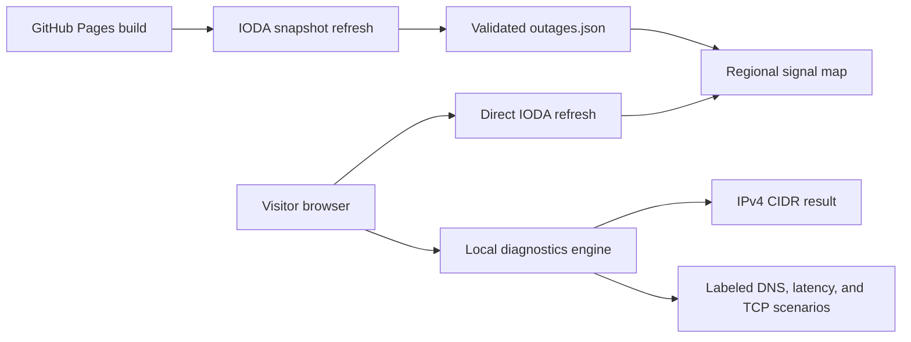

# NetPulse

[](https://github.com/drummer475-94/NetPulse/actions/workflows/verify.yml)
[](package.json)
[](LICENSE)

NetPulse is a mobile-first static web app for finding broad internet-connectivity
signals near a device location or U.S. ZIP code. It uses Georgia Tech's
[Internet Outage Detection and Analysis (IODA)](https://ioda.inetintel.cc.gatech.edu/)
data and is designed to deploy on GitHub Pages.

It also includes a browser-local **NOC Diagnostics** tab for IPv4 CIDR
calculation and deterministic training scenarios for latency, DNS, and TCP
ports. These scenarios use documentation address space and do not send ICMP,
DNS, TCP, or socket traffic. They are illustrative exercises, not measurements
of the selected host or real network services.

## 60-second review

1. Open the [live app](https://drummer475-94.github.io/NetPulse/) and review the state-level IODA signal map.
2. Select **NOC diagnostics** and calculate the example `192.0.2.10/29` range.
3. Run the latency, DNS, and TCP scenarios and verify that each result is explicitly labeled as simulated.
4. Review [`app/diagnostics.ts`](app/diagnostics.ts) for the typed, deterministic engine and [`tests/diagnostics.test.mjs`](tests/diagnostics.test.mjs) for its validation and coverage evidence.

The current suite passes 14 tests. The diagnostics engine reports 100% line and function coverage; CI fails below 90% for either metric.

## Run locally

Requirements: Node.js 22.13 or newer and npm.

```bash
npm ci
npm run dev
```

Device geolocation stays in the browser and is used only in memory. For a ZIP
lookup, NetPulse first asks [Zippopotam.us](https://api.zippopotam.us/). If that
service is unavailable, it falls back to a bundled ZIP-prefix-to-state table and
labels the location as approximate. ZIPs outside the supported 50 states and
District of Columbia cannot use that fallback.

## Build and test

```bash
# Existing Vinext/Sites build
npm run build

# Product checks (includes the Vinext build)
npm test

# Tests plus the diagnostics coverage gate
npm run test:coverage

# GitHub Pages static export to out/
npm run build:pages
```

For a repository project page, set the repository base path before the static
build:

```bash
NEXT_PUBLIC_BASE_PATH=/repository-name npm run build:pages
```

`NEXT_PUBLIC_BASE_PATH` should be empty for a root user or organization Pages
site such as `owner.github.io`. The included Pages workflow calculates this
automatically and supplies `NEXT_PUBLIC_SITE_URL` as the site origin for
absolute social-preview metadata.

## Architecture and data flow



NetPulse has two complementary data paths:

1. The Pages build downloads a 24-hour U.S. regional IODA snapshot to
   `public/data/outages.json`, so the page has data immediately at first paint.
2. After the page loads, the visitor's browser queries IODA directly and
   replaces that snapshot when the request succeeds. If it fails, NetPulse keeps
   the build-time snapshot and accurately shows its age.

Both paths use IODA's `/v2/outages/summary` endpoint with
`entityType=region`, `relatedTo=country/US`, and plain Unix-second `from` and
`until` parameters. The summary produces one aggregate row per region, which is
the right resolution for the state-level display; the regional events endpoint
is not used as the primary source.

Summary rows report aggregate scores and event counts, not trustworthy event
start, end, or update timestamps. NetPulse therefore never infers timing from a
query window or fetch time. A signal means IODA recorded regional activity in
the selected 24-hour window, not that a particular connection is currently
down.

IODA detects macroscopic connectivity disruptions using routing, active probing,
and network-telescope measurements. These signals are not provider
confirmations and do not diagnose an individual home connection.

### Refresh and validate a snapshot

```bash
# Build the current 24-hour IODA snapshot
npm run data:refresh

# Validate the snapshot contract
node scripts/verify-snapshot.mjs
```

If the refresh cannot safely produce a new snapshot, it preserves a valid
checked-in snapshot. When no valid snapshot is available, it writes an explicit
empty `unavailable` snapshot. A valid live snapshot can contain zero events when
the window is quiet; it is never populated with demo data and called live.

### Probe upstream response shapes

```bash
node scripts/probe-ioda.mjs
```

The probe checks the IODA entity and summary responses, performs a narrowly
scoped events-endpoint probe, and reports Zippopotam.us response/CORS details.
In GitHub Actions it also writes those results to the run's step summary. The
daily data-check workflow and Pages deployment both validate the resulting
snapshot before publishing.

## Privacy

The build-time snapshot is served from GitHub Pages. The subsequent live refresh
is a direct browser request to Georgia Tech's IODA service, so IODA can see the
visitor's IP address and the request's ordinary network metadata. NetPulse does
not proxy that refresh. If live refresh is unavailable, the browser continues
to use the static snapshot instead.

## Data model

The `OutageEvent` contract in `app/outage-data.ts` accepts
`kind: "internet" | "power"`. The interface currently activates internet
signals only; the Power control is deliberately disabled and labeled as coming
soon.

## License

Released under the [MIT License](LICENSE).
